```{r setup, include=FALSE}
knitr::opts_chunk$set(echo = FALSE)
```
# 1.0	 Original Data Visualisation

Singapore’s merchandise trade with its top 6 trading markets from years 2019 to 2020 was originally presented as follow:


Figure 1: Original Visualisation

## 1.1 Clarity
It was observed that the clarity of the original visualisation had been diminished by the following shortcomings:

***(a)	Incorrect visualisation header:*** As Hong Kong is not a country but a Special Administrative Region of China, it would be more appropriate to replace the word “countries” with “markets”, and the dashboard header would be “Merchandise Trade of Top Six Trading Markets, 2019 – 2020” instead.

***(b)	Improper labelling and formatting of both x-axis and y-axis:*** Although the x-axis was labelled “Month of Period”, there was no marking to denote the months on the x-axis. In addition, the x-axis for Japan was not properly formatted to show the timeline start from year 2019 and end at start of year 2021, which was also inconsistent with the other country graphs. For the y-axis, the units comprising SGD in thousands ($’000) were also missing.

***(c)	Missing trendlines:*** As the country graphs plot the month-to-month trade values which may fluctuate widely, it is difficult to see if the trade values are on up or down trends for some graphs. In such cases, trendlines would have helped to identify and clarify whether trade values were on the rise or decline.


## 1.2 Aesthetics

The original visualisation was also aesthetically challenged in the following ways:

***(a)	Unnecessary and confusing duplicate y-axes:*** As both import and export values are denoted in SGD, it was not necessary to create country graphs with separate y-axes for import and export values which diminished the areas of the graphs. The problem was also exacerbated by different y-axis markings for import and export values within each graph. As a result, the overlaying of the import and export chart areas seemed overcrowded and confusing, if not misleading, as the import and export areas were not visually comparable due to their different y-axis markings.

***(b)	Inconsistent graph sizes:*** The sizes of the country graphs were obviously not standardised which made the visualisation looked disorganized.

***(c)	Too much brown:*** The shades of brown representing imports as well as overlapping import and export chart areas were too similar. This created an impression that the overlapping chart areas were imports which was incorrect as the overlapping chart areas represented both imports and exports.


# 2.0	 Alternative Graphical Presentation

The proposed alternative graphical presentation is as follow:

 
Figure 2: Alternative Graphical Presentation

## 2.1 Clarity Improvements

The alternative graphical representation would enhance the clarity of the visualisation in the following ways:

***(a)	Refine visualisation header:*** As Hong Kong is not a country but a Special Administrative Region of China, the header is revised to “Singapore’s Top Six Trading Markets - Years 2019 to 2020”. Compared to the original header which did not include “Singapore”, the proposed header highlights Singapore’s trading relationship with the 6 trading markets.

***(b)	Correct labelling and formatting of x- and y-axes:*** Revise x-axis label from “Month of Period” to “Month-Year” and set markings to denote the months on the x-axis. For the y-axis, input y-axis label “$’000” to denote the units for y-axis.

***(c)	Input trendlines:*** Set trendlines for import and export trade values in the country graphs to provide clarity on whether the import and export trade values were on up or down trends. 

***(d)	Add annual market trade value bar chart:*** To facilitate comparison and understanding of the importance of the top trading markets for Singapore, a bar chart illustrating the annual trade values for Singapore's top trading markets in years 2019 and 2020 has been added to the visualisation.  

## 2.2	 Aesthetical Improvements

The proposed alternative graphical representation proposed will also provide the following aesthetical improvements:

***(a)	Remove duplicate y-axis:*** As both import and export values are denoted in SGD, one of the two original double y-axes (for each graph) is removed so that both import and export values could share common y-axis and markings. This would allow the import and export chart areas and trendlines to be comparable since they now have common y-axis markings. At the same time, the overlapping import and export chart areas would become meaningful as these now depict truthfully the extent of overlap between import and export values. 

***(b)	Align graph sizes:*** Re-size and refine the country graphs to ensure they are standardised which will prevent the overall visualisation from looking disorganized.

***(c)	Improve graph colours:*** The intention is to have the colour for the overlapping import and export chart areas distinctly different from the colours used for the standalone import and export chart areas. This is to prevent the impression that the overlapping chart areas are mostly imports or exports which can happen, as with the original visualisation, if the overlap chart area colour belong to any shades of the standalone import or export chart areas. 


# 3.0	 Proposed Visualisation

Please view the interactive visualisation on Tableau Public [**here**](https://public.tableau.com/app/profile/jessica.tan2849/viz/dashboard_16221702508380/Dashboard1).


# 4.0	 Step-by-step Procedure Guide

## 4.1 Data setup & preparation

*	Create a new workbook and click ‘Connect to data’:

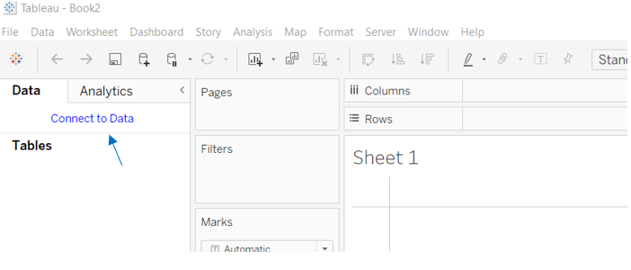 
Figure 4.1.1: Connect to Data

*	Open and load excel file (i.e., outputFile) into Tableau in Datasource template:

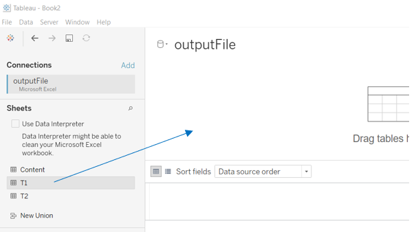 
Figure 4.1.2: Load file

*	Merge files T1 (imports) and T2 via “union”:


Figure 4.1.3: Merge T1 and T2 via “union”

*	Note that a new column “Table Name” emerges after the “union” function applied. This will help to identify the source of the data merged i.e. T1 (imports) or T2 (exports):

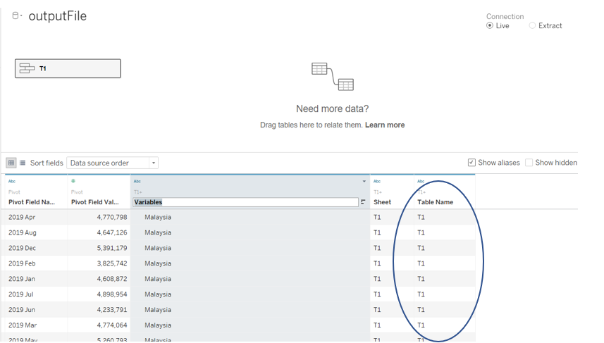 
Figure 4.1.4: Merge T1 and T2 via “union”

*	Clean the merged excel file (T1 and T2) using the “Data Interpreter”.  

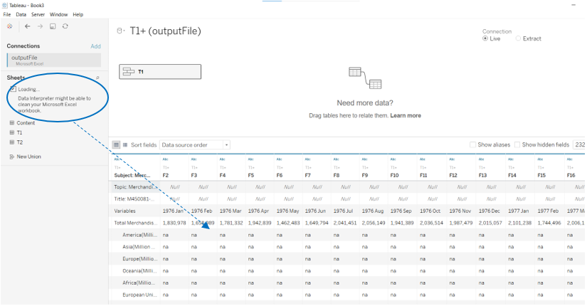
Figure 4.1.5: Clean file via “Data Interpreter”

*	As a result, all previous “na” values were converted to “null”:

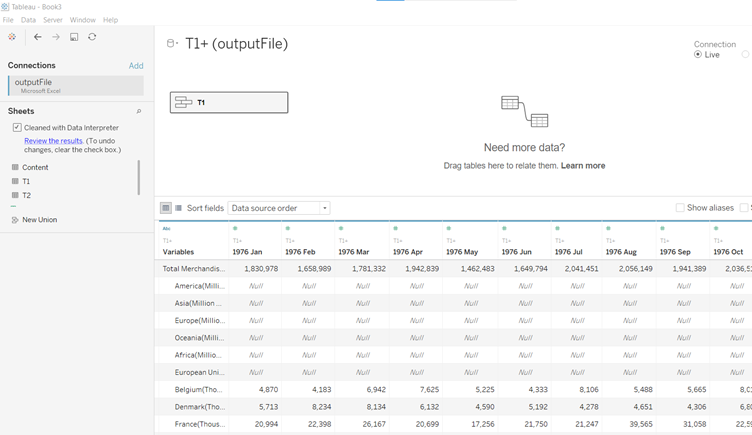 
Figure 4.1.6: Cleaned file

*	Exclude by “hiding” columns from years 1976 to 2018, as well as columns after Dec 2019 as these periods are outside the visualisation timeline:

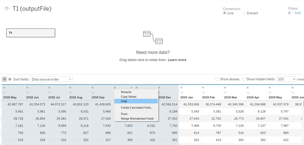 
Figure 4.1.7: Hide irrelevant columns

*	Apply “pivot table” function on the remaining columns from Jan 2019 to Dec 2020 to transpose the data so that month-year data is in a single column,  trade values are in another column and variables (i.e. countries) are in another column:

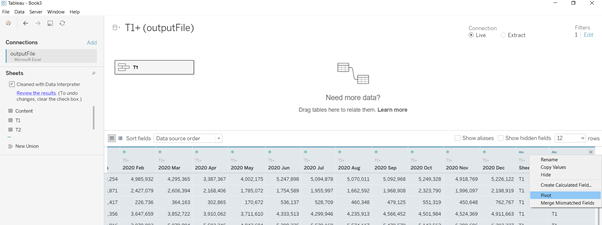 
Figure 4.1.8: Apply “pivot table” function to transpose month-year columns into rows

*	Rename the transposed columns – i.e., relevant pivot field columns into “Month-Year”, “Trade Values”, “Trade Types”, and Countries” (previously “Variables”):

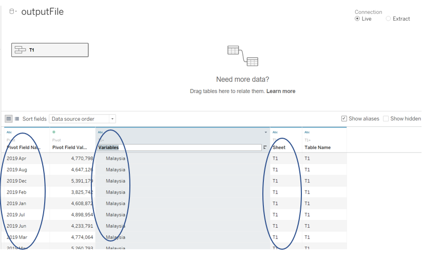 
Figure 4.1.9: Rename columns and variables of transposed data

*	Check and convert data columns’ content into correct data types, e.g. date fields should be in date data type:

 
Figure 4.1.10: Check and ensure correct data types of data fields

*	Using the Aliases function, check and clean/remove words “(Thousands Dollars”) from country names; re-word date data from “year-month” format to “month-year”; and convert “T1” into “import” and “T2” into “export” in Sheet column which column name would be change to “Trade Type” as mentioned above:

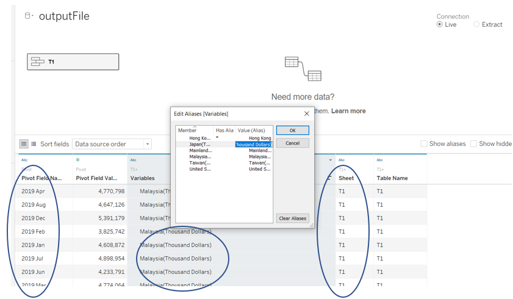 
Figure 4.1.11: Check and clean/re-word column contents using “Aliases” function 

## 4.2 Visualisation Re-design

*	To create individual country graphs, filter countries column by dropping “Countries” into “Filters” section of the Tableau worksheet and select the respective country name:

 
Figure 4.2.1: Filter “Countries” to select country for visualisation

*	Thereafter, drop “Month-Year” table into Columns and select “Month” in the continuous (lower) section of the drop-down list so that the graph will be plotted with Month-Year on x-axis in continuous format: 

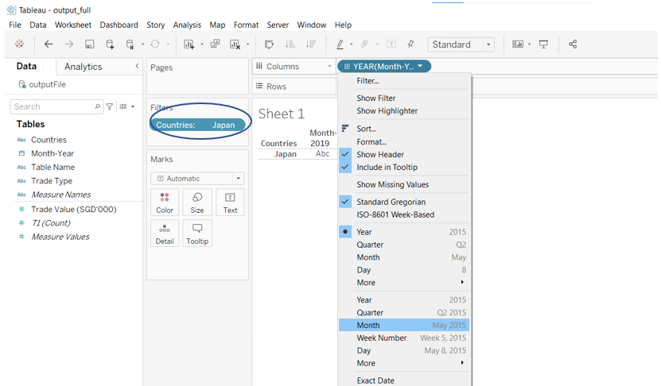 
Figure 4.2.2: Select continuous “Month” in drop-down list 

*	Thereafter, drop “Trade Value” into Rows and drag “Trade Type” into “Marks-Color” field to provide different colours to differentiate between import and export trade values:
 
 
Figure 4.2.3: Drop “Trade Value” into Rows and “Trade Type” into “Marks-Color” 

*	Next, to correct the x-axis label which had been auto-generated as “Month of Month Year”, right click on x-axis panel and choose “Edit Axis” to change the axis label to “Month-Year”:

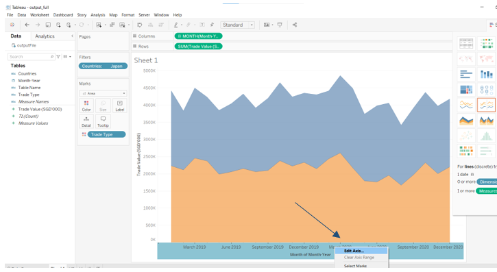  
Figure 4.2.4: Change x-axis label to “Month-Year”

*	Thereafter, format both x and y-axes by clicking on their panels and choose “format” in turn. For x-axis, choose “Up” at Axis-Title to tilt “Month-Year” at 90-degrees. This will enable more Month-Year markings to be fitted on x-axis: 

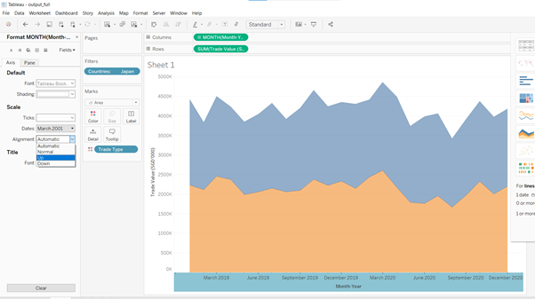 
Figure 4.2.5: Format “Month-Year” markings on x-axis to “Up” 

*	Note below that the x-axis can now accommodate more “Month-Year” markings after the above change. Thereafter, format the y-axis panel to standardise the ticks across the graphs:

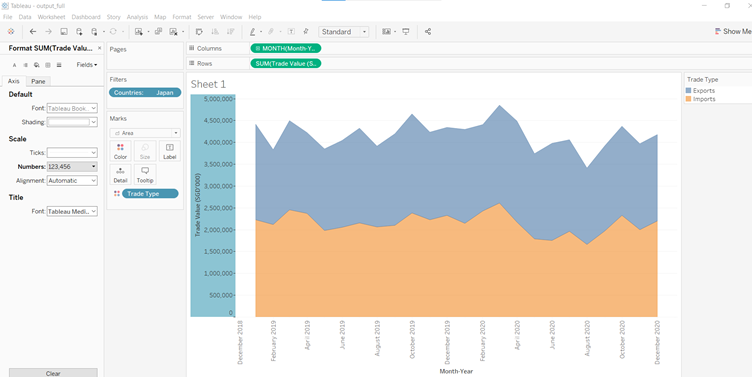 
Figure 4.2.6: Standardise y-axis markings across graphs 

*	Next, the x and y-axis panels would be formatted for colour shading: 

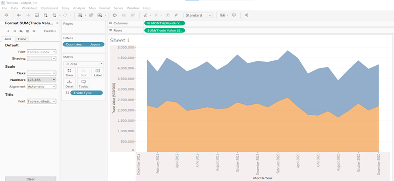 
Figure 4.2.7: Format axes panel shading 

*	Thereafter, format the colour shading to the entire worksheet by clicking on the sheet template and choose worksheet colour: 

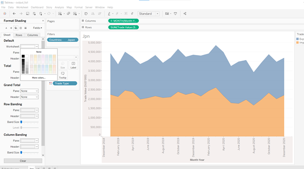 
Figure 4.2.8: Format colour shading for entire worksheet 

*	After shading the entire worksheet, input the country name into the Sheet Title by clicking on the Title panel and then write-on:

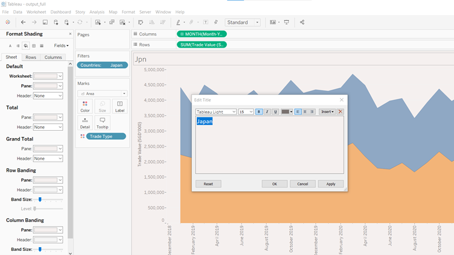 
Figure 4.2.9: Insert country name into title panel of country graph 

*	Next, insert trendlines for the import (orange) and exports (blue) trade values by right clicking on mouse and choosing “Trendlines” and “Show Trend Lines”:

 
Figure 4.2.10: Input trendlines for import and export trade values

*	The completed individual country graph/worksheet is as follow:

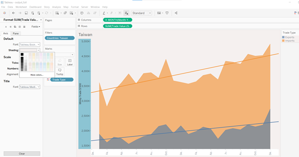 
Figure 4.2.11: Individual country graph with import and export trendlines

*	Aside from the individual country graphs performed for the top 6 trading markets by trade value, a global consolidated graph is also made to rank the countries by trade values to determine the top (10) trading markets. 

*	First, drop “Countries” into “Rows” as well as “Filters” fields. Then, select “General” and scroll to bottom of list to untick “Total Merchandise Exports” and “Total Merchandise Imports” as these should not be included because they are consolidated values:

 
Figure 4.2.12: Exclude “Total Merchandise Imports” and “Total Merchandise Exports”

*	Next, select “Top”, and click on “By field” and input 10 to filter the Top 10 markets by “Trade Value”, choosing “Sum”:

 
Figure 4.2.13: Filter for the Top 10 countries

*	Drop “Trade Value” and “Month-Year” into Columns. For “Month-Year”, choose “Year” in upper (non-continuous) section of drop-down list. This is to provide separate summations of the trade values for each country by year:

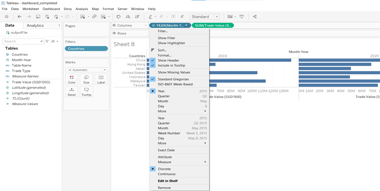 
Figure 4.2.14: Select upper (non-continuous) “Year” attribute for “Month-Year” in Columns field

*	Input graph title by clicking on the title panel and typing in the “Edit Title” box:

 
Figure 4.2.15: Input graph title into title panel

*	Click on the “sort” icon at the top-right tip of each of the 2 bar charts to sort in descending order:

 
Figure 4.2.16: Sort the bars for trade values in descending order

*	Format the figures for the trade values to fit them into bars by clicking on the “Trade Value” table on the left panel and choose “default properties” and then “number format”. Thereafter, select “Number (custom)” and choose “Million (M)” for display units:

 
Figure 4.2.17: Label bar chart with trade values

## 4.3 Dashboard Building

*	To build the dashboard, input the 7 completed worksheets (i.e., 6 individual country graphs and 1 consolidated graph) into the dashboard:

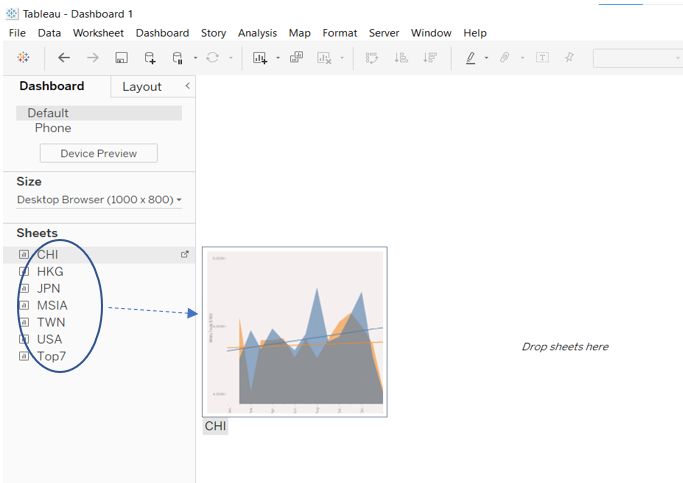 
Figure 4.3.1: Input completed worksheets into dashboard

*	Thereafter, click on format dashboard to provide colour shading for the dashboard:

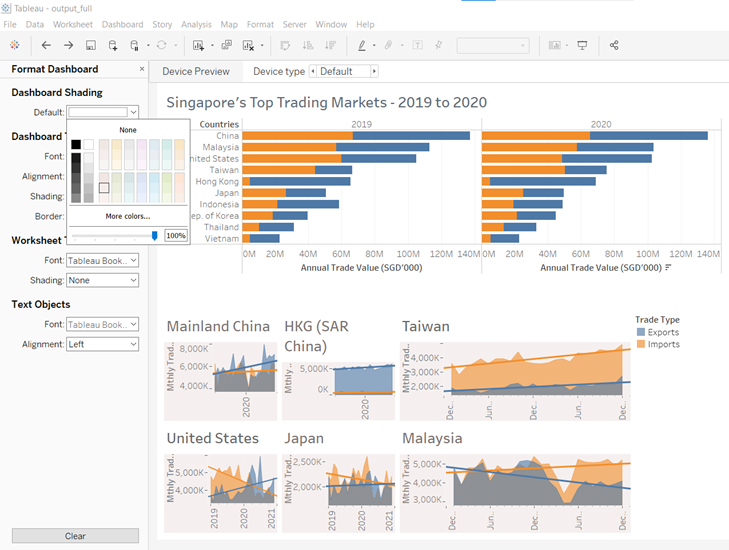 
Figure 4.3.2: Colour shading for dashboard

*	Finally, refine the dashboard presentation by re-sizing the individual charts to fit properly into the dashboard, and add dashboard title by clicking on the title panel and inputting in the pop-up “Edit Title” box:

 
Figure 4.3.3: Proper sizing individual charts and add dashboard title


# 5.0	 Major Observations

Re-designed visualisation:
 

Figure 5: Re-designed Visualisation

The major observations from re-designed visualisation are as follow:

***(a)	Total annual trade value with Japan rose from 7th place in year 2019 to 6th place in year 2020*** (in above top markets ranking list), surpassing Indonesia which was 6th place in 2019. This was primarily due to decline in trade value with Indonesia in year 2020 whilst trade value with Japan in year 2020 maintained close to 2019 level.
  
***(b)	For Singapore’s top 6 trading markets in year 2020, exports were generally on uptrend and grew compared to previous year except for exports to Malaysia.*** Singapore’s export value to Malaysia had fallen off a cliff in early 2020 and troughed around April 2020, but remained below its 2019 level throughout 2020.  On the other hand, imports from Malaysia, Taiwan, and Hong Kong grew in year 2020 compared to prior year whilst imports from China, United States and Japan fell. The decline in import and export trade values with these four countries – Malaysia (exports), China (imports), United States (imports), and Japan (imports) – showed the adverse impact of the COVID19 pandemic on trade activities with these countries.  

***(c)	Within the top 6 trading markets, Singapore was a net exporter to 3 markets in year 2020***, i.e., China, Hong Kong and USA ***whilst in year 2019, Singapore was a net exporter to 2 markets*** i.e., China and Hong Kong. In 2020, exports to Japan also rose to enable breakeven trade balance and Singapore was net importer to 2 markets i.e., Malaysia and Taiwan. In contrast, Singapore was a net importer to 4 out of the same 6 trading markets in 2019.


*~ End*
